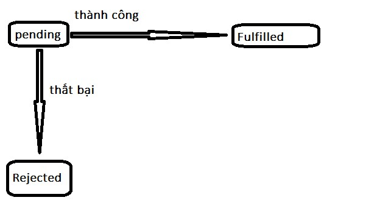

#  PHIẾU BÀI TẬP 10 ASYNC JAVASCRIPT & API INTEGRATION
## PHẦN A — KIỂM TRA ĐỌC HIỂU (15 điểm)
### Câu A1 (5đ) — Sync vs Async
Thứ tự output = ??? Giải thích Event Loop, Microtask Queue, Macrotask Queue.  
```
1 - Start
4 - End
3 - Promise
6 - Promise 2
2 - Timeout 0ms
7 - Nested timeout
5 - Timeout 100ms
```
- Event Loop là cơ chế giúp JavaScript xử lý code bất đồng bộ.  
JavaScript chạy theo thứ tự ưu tiên:Event Loop là cơ chế giúp JavaScript xử lý code bất đồng bộ.  
JavaScript chạy theo thứ tự ưu tiên:  
```
1. Call Stack / Synchronous code
2. Microtask Queue
3. Macrotask Queue
```
Microtask Queue chứa các tác vụ ưu tiên cao hơn Macrotask

### Câu A2 (5đ) Fetch API
1. await fetch(...) — fetch trả về một Promise, kết quả sau khi hoàn thành là một object kiểu Response. Cần await vì request API mất thời gian. Nếu không dùng await, biến response sẽ là Promise chứ chưa phải dữ liệu phản hồi thật
2. response.ok — là true nếu HTTP status nằm trong khoảng: 200-299, là false nếu API trả về lỗi HTTP 
Liệt kê 3 status codes tương ứng:  
```
404 Not Found
401 Unauthorized
500 Internal Server Error
```
3. response.json() — Nếu response không thành công, tự tạo lỗi mới, cần await lần nữa vì response.json() cũng là thao tác bất đồng bộ và trả về một Promise
4. try...catch — Catch những lỗi như :
```
Network error
JSON parse error
Lỗi do mình tự throw
```
- catch cũng có thể không tự bắt lỗi 404 hoặc 500 và dẽ in lỗi ra console  

### Câu A3 (5đ) — Promise States
Vẽ sơ đồ 3 trạng thái của Promise (Pending → Fulfilled, Pending → Rejected)  
Giải thích: Callback Hell là gì? Viết ví dụ 4 cấp callback hell → Refactor thành async/await  



- Callback Hell là tình trạng có quá nhiều callback lồng nhau, làm code bị thụt sâu, khó đọc, khó sửa và khó xử lý lỗi, và hay xảy ra khi vô số tác vụ bất đồng với nhau lại chạy theo thứ tự 

- Vi du:
```
loginUser("minh", function(user) {
    getProfile(user.id, function(profile) {
        getPosts(profile.id, function(posts) {
            getComments(posts[0].id, function(comments) {
                console.log(comments);
            });
        });
    });
});
```

=> Refactor thành async/await :
```
async function loadUserData() {
    try {
        const user = await loginUser("minh");
        const profile = await getProfile(user.id);
        const posts = await getPosts(profile.id);
        const comments = await getComments(posts[0].id);

        console.log(comments);
    } catch (error) {
        console.error("Lỗi:", error.message);
    }
}
```
## PHẦN C — PHÂN TÍCH (20 điểm)
### Câu C1 (10đ) — Error Handling Strategy
Bạn xây dựng app E-Commerce gọi nhiều APIs. Thiết kế chiến lược xử lý lỗi:  

1. Network errors (mất mạng giữa chừng) → Xử lý 
```
- Người dùng mất mạng
- Server không kết nối được
- DNS lỗi
- CORS bị chặn
```
=> Cách xử lý:
```
- Hiển thị thông báo: "Không có kết nối mạng"
- Không crash app
- Cho người dùng bấm "Thử lại"
- Có thể retry tự động vài lần
```
2. API errors (server trả 500, 404, 429 Too Many Requests) → Xử lý từng loại  

| Status code | Ý nghĩa | Cách xử lý |
|---|---|---|
| 404 Not Found | Không tìm thấy sản phẩm / API | Hiển thị “Sản phẩm không tồn tại” |
| 500 Internal Server Error | Server bị lỗi | Báo Server đang gặp sự cố |
|429 Too Many Requests | Gửi quá nhiều request | gọi lại |  

3. Timeout (API chậm > 10 giây) → Viết code fetchWithTimeout(url, ms)  
[viducode](CSE391_TranTheMinh_2251262619\PBT_10\code_phanC\fetch_with_timeout.js)
4. Retry logic (thử lại 3 lần nếu lỗi network) → Viết code fetchWithRetry(url, maxRetries)
[viducodepP2](CSE391_TranTheMinh_2251262619\PBT_10\code_phanC\fetch_with_retry) 

### Câu C2 — Promise.all vs Promise.allSettled vs Promise.race vs Promise.any 

| Method | Khi nào resolve? | Khi nào reject | Use case |  
|---|---|---|---|
|Promise.all()|	Khi tất cả Promise đều fulfilled|	Khi chỉ cần 1 Promise rejected|	Khi tất cả dữ liệu đều bắt buộc phải có|
|Promise.allSettled()|	Khi tất cả Promise đã xong, dù thành công hay thất bại	|Gần như không reject trong xử lý thông thường|	Khi muốn lấy kết quả thành công và bỏ qua phần lỗi|
|Promise.race()	|Khi Promise đầu tiên fulfilled|	Khi Promise đầu tiên rejected	|Timeout API, lấy kết quả phản hồi nhanh nhất|
|Promise.any()|	Khi có Promise đầu tiên fulfilled	|Khi tất cả Promise đều rejected|	Gọi nhiều server dự phòng, chỉ cần một nguồn thành công|